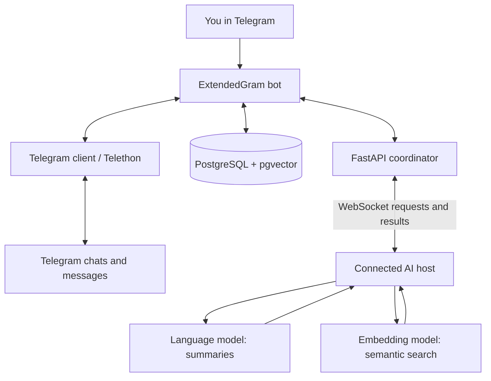

# ExtendedGram

**Catch up on Telegram conversations, find forgotten messages, and stay organized with AI.**

ExtendedGram is a Telegram assistant for people who have too many messages to read and too much information scattered across chats. It can summarize conversations, search for messages by meaning, and help you focus on the chats that matter to you—all through a Telegram bot.

It works with private chats, groups, channels, and individual forum topics. You decide which conversations the assistant is allowed to process. **Your Telegram session is encrypted before it is stored; encryption is mandatory.**

> **Project status:** ExtendedGram is under active development. Availability and the exact menus may change.

## What can you do with ExtendedGram?

### 📝 Catch up without scrolling

If a group has hundreds of unread messages, you can ask ExtendedGram to summarize the conversation instead of reading everything one by one.

The assistant groups messages into related topics and focuses on useful details such as **decisions, deadlines, questions, plans, and conclusions**, rather than repeating the entire chat.

**For example:** After missing a day of messages in a university group, you could get a summary of upcoming assignments, changes to a meeting time, and questions that still need answers.

You can adjust how much conversation history the assistant takes into account. If you prefer, you can also have messages marked as read after a summary.

### 🔎 Find messages by meaning

Telegram's ordinary search is useful when you remember a word or phrase. ExtendedGram is designed for the times when you remember **what was discussed**, but not **how it was phrased**.

For example, search for:

> What did we agree on for the trip next weekend?

ExtendedGram can look for related conversations about dates, transport, or accommodation—even if your exact question never appeared in the chat. It also retrieves nearby messages so you can see the surrounding context.

Search quality depends on the available message history and the AI model; relevant results are not guaranteed every time.

### 💬 Keep different conversations separate

ExtendedGram supports:

- Private one-to-one chats
- Groups and supergroups
- Channels
- Individual forum topics inside groups

Forum topics are handled separately so that, for example, a group's *Homework* topic does not get mixed up with its *Announcements* topic.

### ⚙️ Control how it behaves

You can personalize the assistant through its settings:

- **Allowed conversations:** Let it process all available chats or only chats you select.
- **History size:** Choose how much message history is considered.
- **Read status:** Decide whether processed messages should be marked as read automatically.
- **Preloading:** Configure preparation of message history for later searches.

This lets you use ExtendedGram for a single busy group or across multiple conversations.

## Getting started

You don't need to understand databases, AI models, or servers to use the bot.

1. **Open an ExtendedGram bot instance you trust.** Get the bot's Telegram link from its operator. There is no public bot link listed here yet.
2. **Send `/start`.** Follow the instructions shown by the bot.
3. **Connect your Telegram account.** Enter your phone number and Telegram verification code. If two-step verification is enabled, follow the additional password prompt.
4. **Choose which chats can be processed.** Review your allowed-chat settings before using search or summaries.
5. **Use the menu.** Choose **Summarize**, **Search**, or **Settings** depending on what you need.

**Example workflow:** Open the bot after a busy day → select your class group → request a summary → search for “when is the project due?” if you need a specific detail.

> **Important:** Connecting an account creates a Telegram user session, which can access Telegram on your behalf. Only log in through an instance whose operator you trust. Never send login codes or passwords to people in direct messages.

## 🔐 Privacy and security

ExtendedGram needs to read messages from conversations you authorize. It also needs to remember your Telegram login so that you aren't asked to sign in every time you search or request a summary.

### Why is a Telegram session stored?

A **session** is a digital login credential. Once you've connected your account, it lets the application talk to Telegram for you. Without a stored session, you'd need to complete the login process again and again.

Because a session is sensitive, **ExtendedGram encrypts Telegram sessions before storing them. This protection is mandatory, not an optional setting.**

### What protects the stored session?

- **Encryption:** ExtendedGram uses **AES-256-GCM** to turn the stored session into unreadable encrypted data. This also helps detect unauthorized changes to that data.
- **Password-derived protection:** It uses **PBKDF2-HMAC-SHA256**, with **600,000 iterations** and a random salt, to derive an encryption key. This makes password guessing more expensive.
- **Fresh random values:** Encryption uses randomized values so the same original text does not always produce identical encrypted output.
- **Encoding for storage:** The encrypted result is converted to a text-friendly representation using Base64. **Encoding is not encryption**; AES-GCM is what protects the contents.

**What does this mean in practice?** Someone who obtains only the encrypted session from the database should not be able to use it without the information required to decrypt it. This is an important safeguard, but it isn't a guarantee against every kind of account compromise.

### Does this mean nobody else can access my messages?

No. ExtendedGram must use the session while it is running in order to read the conversations you permit. The application operator's security practices are important, even when stored sessions are encrypted.

You can **limit which chats are processed**. This is different from limiting what access a Telegram user session technically has, so you should still use only instances you trust.

### Where does AI processing happen?

ExtendedGram can use AI models running on a local computer or a connected/shared computing host. The messages needed for a request may be sent to the host performing the processing.

If you join a group that shares computing resources, **use a host you trust**. Local AI processing can reduce reliance on external AI services, but does not by itself guarantee that messages are private from a host operator. The application may also store messages and their AI-generated representations to enable later searches.

### A few safety tips

- Use only an ExtendedGram instance operated by someone you trust.
- Select only the conversations you want the assistant to process.
- Think carefully before using shared AI hosts for sensitive conversations.
- Treat any unexpected request for Telegram credentials as suspicious.

## How ExtendedGram works

*This section is for curious users and developers. You can use the bot without understanding it.*

### Architecture diagram

The diagram is simplified: it shows the key components and how they cooperate, not every internal request or database operation.

### When you ask for a summary

1. The Telegram client retrieves messages from the selected conversation.
2. ExtendedGram prepares the conversation and organizes it for AI processing.
3. An AI language model identifies related topics and produces a compact summary.
4. The bot sends the summary back to you in Telegram.

### When you search for something

1. ExtendedGram converts your question into a numerical representation of its meaning (an **embedding**).
2. It compares that representation with stored message embeddings to find related messages.
3. It retrieves surrounding messages when available, so a result isn't shown without context.
4. It returns the relevant messages through the bot.

### Why are there separate AI hosts?

Running AI models can require a powerful computer. ExtendedGram separates the bot from that heavy processing, so a connected **host** can handle AI requests and return the results.

A FastAPI backend coordinates work with hosts over WebSockets. Depending on the setup, a user can use their own host or participate in a group where computing resources are shared. **Sharing compute also means trusting the host with the content sent for processing.**

### Technology behind the project

| Purpose | Technology |
| --- | --- |
| Telegram account access | Telethon |
| Bot interface | python-telegram-bot |
| Application language | Python |
| Coordination and communication | FastAPI and WebSockets |
| Message storage | PostgreSQL |
| Meaning-based search | pgvector and embedding models |
| Summarization | Large language models through OpenAI-compatible APIs |
| Containerization | Docker |

## Project status

**Under active development.** ExtendedGram is a personal software engineering project exploring practical uses of language models, semantic search, Telegram automation, and distributed AI processing. Features and user experience may change.

## Author

Created by [Anton Chebotarov](https://github.com/tonda228).